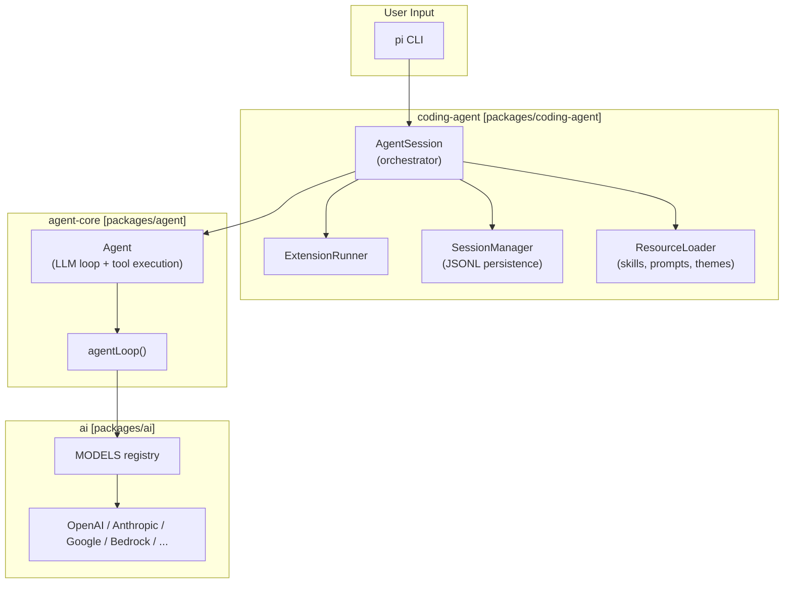

# DeepWiki Q&A with Code Context for Repository: badlogic/pi-mono
## Q1
How does this work?
https://github.com/badlogic/pi-mono

The user wants to understand the `badlogic/pi-mono` repository - what it is, how it works, and how to customize/build on top of it (skills, extensions, etc.). Let me start by reading the wiki and exploring the repository structure in parallel.

Let me dive deeper into the key areas the user wants to understand: skills, extensions, custom tools, and how to build on top of this pi agent. I'll read multiple wiki pages in parallel and explore the key source files.

Let me now look at the actual example files and key source files to give a concrete, grounded answer about how to build on top of pi. I'll read the extension examples, the subagent example, and the SDK examples in parallel.

I now have a comprehensive understanding of the pi-mono repository. Let me compile a thorough answer covering:

1. What pi-mono is
2. How the architecture works
3. How to customize it via:
   - Extensions (custom tools, event hooks, commands, shortcuts)
   - Skills (SKILL.md files)
   - Prompt Templates
   - Custom LLM providers
   - Subagent architecture
4. Key files and patterns

Let me write a clear, well-structured answer.


Here is a comprehensive breakdown of `badlogic/pi-mono` and how to build on top of it.

---

## What is pi-mono?

`pi-mono` is a monorepo for `pi`, an LLM-powered coding agent CLI. It is similar in spirit to Claude Code or Cursor, but fully open and extensible. The primary binary is `pi`, which gives an LLM access to your filesystem and shell, and lets you extend it with TypeScript.

```
packages/
├── coding-agent/   ← the `pi` CLI (main thing you interact with)
├── agent/          ← core agent loop (LLM ↔ tools ↔ events)
├── ai/             ← unified API for 15+ LLM providers
├── tui/            ← terminal UI rendering
├── web-ui/         ← browser chat components
├── mom/            ← Slack bot
└── pods/           ← GPU/vLLM pod manager
``` pi-mono:4-11 

---

## Core Architecture



The `AgentSession` class in `packages/coding-agent/src/core/agent-session.ts` is the central orchestrator. It wraps the lower-level `Agent` from `pi-agent-core`, adds session persistence, extension hooks, auto-compaction, and auto-retry. pi-mono:114-131 

---

## The Three Ways to Customize pi

### 1. Extensions (most powerful)

Extensions are TypeScript files that receive an `ExtensionAPI` object. They are loaded via [jiti](https://github.com/unjs/jiti) — **no compilation step needed**.

**Auto-discovery locations:**

| Path | Scope |
|---|---|
| `~/.pi/agent/extensions/*.ts` | Global |
| `~/.pi/agent/extensions/*/index.ts` | Global (multi-file) |
| `.pi/extensions/*.ts` | Project-local |
| `.pi/extensions/*/index.ts` | Project-local (multi-file) | pi-mono:111-133 

**Minimal extension skeleton:**

```typescript
// ~/.pi/agent/extensions/my-ext.ts
import type { ExtensionAPI } from "@mariozechner/pi-coding-agent";
import { Type } from "typebox";

export default function (pi: ExtensionAPI) {
  // 1. Subscribe to lifecycle events
  pi.on("session_start", async (_event, ctx) => {
    ctx.ui.notify("Extension loaded!", "info");
  });

  // 2. Register a custom LLM-callable tool
  pi.registerTool({
    name: "greet",
    label: "Greet",
    description: "Greet someone by name",
    parameters: Type.Object({
      name: Type.String({ description: "Name to greet" }),
    }),
    async execute(_toolCallId, params, _signal, _onUpdate, _ctx) {
      return {
        content: [{ type: "text", text: `Hello, ${params.name}!` }],
        details: {},
      };
    },
  });

  // 3. Register a slash command
  pi.registerCommand("hello", {
    description: "Say hello",
    handler: async (args, ctx) => {
      ctx.ui.notify(`Hello ${args || "world"}!`, "info");
    },
  });
}
``` pi-mono:1-26 

#### Event Hooks (full lifecycle)

```
session_start → input → before_agent_start → agent_start
  → turn_start → context → tool_call → tool_result → turn_end
  → agent_end
```

Key hooks for customization:

| Event | What you can do |
|---|---|
| `before_agent_start` | Inject messages, modify system prompt |
| `tool_call` | Block or mutate tool arguments before execution |
| `tool_result` | Modify tool output before LLM sees it |
| `context` | Filter/rewrite the message history each turn |
| `session_before_compact` | Provide custom compaction summaries |
| `resources_discover` | Add extra skill/prompt/theme paths | pi-mono:269-330 

#### Blocking a tool call (permission gate pattern):

```typescript
pi.on("tool_call", async (event, ctx) => {
  if (event.toolName === "bash" && event.input.command?.includes("rm -rf")) {
    const ok = await ctx.ui.confirm("Dangerous!", "Allow rm -rf?");
    if (!ok) return { block: true, reason: "Blocked by user" };
  }
});
``` pi-mono:656-679 

#### Overriding built-in tools (bash, read, write, edit):

```typescript
// Replace bash with a sandboxed version
pi.registerTool({
  ...localBash,
  label: "bash (sandboxed)",
  async execute(id, params, signal, onUpdate, _ctx) {
    return sandboxedBash.execute(id, params, signal, onUpdate);
  },
});
``` pi-mono:214-227 

#### Registering a custom LLM provider:

```typescript
export default async function (pi: ExtensionAPI) {
  const response = await fetch("http://localhost:1234/v1/models");
  const payload = await response.json();

  pi.registerProvider("local-openai", {
    baseUrl: "http://localhost:1234/v1",
    apiKey: "LOCAL_OPENAI_API_KEY",
    api: "openai-completions",
    models: payload.data.map((model) => ({
      id: model.id,
      name: model.name ?? model.id,
      reasoning: false,
      input: ["text"],
      cost: { input: 0, output: 0, cacheRead: 0, cacheWrite: 0 },
      contextWindow: model.context_window ?? 128000,
      maxTokens: model.max_tokens ?? 4096,
    })),
  });
}
``` pi-mono:186-214 

---

### 2. Skills (on-demand capability packages)

Skills are Markdown files that the agent loads **on-demand** when a task matches the description. Only the name + description are always in the system prompt (token-efficient). The full instructions are fetched via the `read` tool when needed.

**Structure:**

```
~/.pi/agent/skills/
└── my-skill/
    ├── SKILL.md        ← required
    ├── scripts/
    │   └── run.sh
    └── references/
        └── api.md
```

**`SKILL.md` format:**

```markdown
---
name: my-skill
description: Detailed description of what this skill does and when to use it.
---

# My Skill

## Setup
```bash
cd /path/to/skill && npm install
```

## Usage
```bash
./scripts/run.sh <input>
```
``` pi-mono:94-130 

Users can force a skill with `/skill:my-skill [args]`. The `description` field is critical — it determines when the agent auto-loads the skill. pi-mono:64-82 

---

### 3. Prompt Templates

Reusable Markdown prompts with bash-style variable substitution, stored in `~/.pi/agent/prompts/` or `.pi/prompts/`.

| Syntax | Meaning |
|---|---|
| `$1`, `$2` | Positional args |
| `$@` / `$ARGUMENTS` | All args joined |
| `${@:N}` | Args from index N | pi-mono:68-102 

---

## Subagent Architecture

The `subagent` extension example shows how to build multi-agent workflows. It spawns separate `pi` processes in `--mode json -p --no-session` mode and parses their JSON event stream.

Three modes are supported:

- **Single**: `{ agent: "name", task: "..." }` — delegate to one agent
- **Parallel**: `{ tasks: [{agent, task}, ...] }` — run up to 4 agents concurrently
- **Chain**: `{ chain: [{agent, task}, ...] }` — sequential, with `{previous}` placeholder pi-mono:1-13 

Agents are defined as config files in `~/.pi/agent/agents/` (global) or `.pi/agents/` (project-local), each with a system prompt, model, and allowed tools. pi-mono:265-310 

---

## Key Patterns for Building on pi

### State persistence across sessions

```typescript
// Save state
pi.appendEntry("my-ext", { key: "value" });

// Restore on session start
pi.on("session_start", async (_event, ctx) => {
  const entries = ctx.sessionManager.getEntries();
  const myEntry = entries.filter(e => e.type === "custom" && e.customType === "my-ext").pop();
  if (myEntry?.data) { /* restore */ }
});
``` pi-mono:91-97 

### Injecting context before each agent turn

```typescript
pi.on("before_agent_start", async () => {
  return {
    message: {
      customType: "my-context",
      content: "Additional instructions for this turn",
      display: false,  // hidden from TUI
    },
    systemPrompt: event.systemPrompt + "\n\nExtra rules...",
  };
});
``` pi-mono:159-205 

### Dynamically controlling which tools are active

```typescript
pi.setActiveTools(["read", "bash", "grep"]);  // restrict to read-only
pi.setActiveTools(["read", "bash", "edit", "write"]);  // restore full access
``` pi-mono:82-88 

### Using `StringEnum` for Google API compatibility

```typescript
import { StringEnum } from "@mariozechner/pi-ai";
// Required for Google models — Type.Union([Type.Literal(...)]) doesn't work
action: StringEnum(["list", "add"] as const)
``` pi-mono:182-191 

---

## Where to Find Examples

All working examples are in:


Key ones to study:

| File | What it demonstrates |
|---|---|
| `hello.ts` | Minimal custom tool |
| `plan-mode/index.ts` | Full extension with commands, hooks, state, UI widgets |
| `subagent/index.ts` | Multi-agent orchestration (parallel, chain, single) |
| `sandbox/index.ts` | Overriding built-in `bash` tool with OS-level sandboxing |
| `bash-spawn-hook.ts` | Wrapping bash with env/command injection |
| `custom-provider-anthropic/` | Custom LLM provider with OAuth |
| `todo.ts` | Stateful tool with custom TUI rendering |

The full extension API reference is at: pi-mono:1-53 

And the skills documentation at: pi-mono:1-40
### Citations
**File:** packages/coding-agent/package.json (L4-11)
```json
	"description": "Coding agent CLI with read, bash, edit, write tools and session management",
	"type": "module",
	"piConfig": {
		"name": "pi",
		"configDir": ".pi"
	},
	"bin": {
		"pi": "dist/cli.js"
```
**File:** packages/coding-agent/src/core/agent-session.ts (L114-131)
```typescript
export type AgentSessionEvent =
	| AgentEvent
	| {
			type: "queue_update";
			steering: readonly string[];
			followUp: readonly string[];
	  }
	| { type: "compaction_start"; reason: "manual" | "threshold" | "overflow" }
	| {
			type: "compaction_end";
			reason: "manual" | "threshold" | "overflow";
			result: CompactionResult | undefined;
			aborted: boolean;
			willRetry: boolean;
			errorMessage?: string;
	  }
	| { type: "auto_retry_start"; attempt: number; maxAttempts: number; delayMs: number; errorMessage: string }
	| { type: "auto_retry_end"; success: boolean; attempt: number; finalError?: string };
```
**File:** packages/coding-agent/docs/extensions.md (L1-53)
```markdown
> pi can create extensions. Ask it to build one for your use case.

# Extensions

Extensions are TypeScript modules that extend pi's behavior. They can subscribe to lifecycle events, register custom tools callable by the LLM, add commands, and more.

> **Placement for /reload:** Put extensions in `~/.pi/agent/extensions/` (global) or `.pi/extensions/` (project-local) for auto-discovery. Use `pi -e ./path.ts` only for quick tests. Extensions in auto-discovered locations can be hot-reloaded with `/reload`.

**Key capabilities:**
- **Custom tools** - Register tools the LLM can call via `pi.registerTool()`
- **Event interception** - Block or modify tool calls, inject context, customize compaction
- **User interaction** - Prompt users via `ctx.ui` (select, confirm, input, notify)
- **Custom UI components** - Full TUI components with keyboard input via `ctx.ui.custom()` for complex interactions
- **Custom commands** - Register commands like `/mycommand` via `pi.registerCommand()`
- **Session persistence** - Store state that survives restarts via `pi.appendEntry()`
- **Custom rendering** - Control how tool calls/results and messages appear in TUI

**Example use cases:**
- Permission gates (confirm before `rm -rf`, `sudo`, etc.)
- Git checkpointing (stash at each turn, restore on branch)
- Path protection (block writes to `.env`, `node_modules/`)
- Custom compaction (summarize conversation your way)
- Conversation summaries (see `summarize.ts` example)
- Interactive tools (questions, wizards, custom dialogs)
- Stateful tools (todo lists, connection pools)
- External integrations (file watchers, webhooks, CI triggers)
- Games while you wait (see `snake.ts` example)

See [examples/extensions/](../examples/extensions/) for working implementations.

## Table of Contents

- [Quick Start](#quick-start)
- [Extension Locations](#extension-locations)
- [Available Imports](#available-imports)
- [Writing an Extension](#writing-an-extension)
  - [Extension Styles](#extension-styles)
- [Events](#events)
  - [Lifecycle Overview](#lifecycle-overview)
  - [Resource Events](#resource-events)
  - [Session Events](#session-events)
  - [Agent Events](#agent-events)
  - [Tool Events](#tool-events)
- [ExtensionContext](#extensioncontext)
- [ExtensionCommandContext](#extensioncommandcontext)
- [ExtensionAPI Methods](#extensionapi-methods)
- [State Management](#state-management)
- [Custom Tools](#custom-tools)
- [Custom UI](#custom-ui)
- [Error Handling](#error-handling)
- [Mode Behavior](#mode-behavior)
- [Examples Reference](#examples-reference)

```
**File:** packages/coding-agent/docs/extensions.md (L111-133)
```markdown
Extensions are auto-discovered from:

| Location | Scope |
|----------|-------|
| `~/.pi/agent/extensions/*.ts` | Global (all projects) |
| `~/.pi/agent/extensions/*/index.ts` | Global (subdirectory) |
| `.pi/extensions/*.ts` | Project-local |
| `.pi/extensions/*/index.ts` | Project-local (subdirectory) |

Additional paths via `settings.json`:

```json
{
  "packages": [
    "npm:@foo/bar@1.0.0",
    "git:github.com/user/repo@v1"
  ],
  "extensions": [
    "/path/to/local/extension.ts",
    "/path/to/local/extension/dir"
  ]
}
```
```
**File:** packages/coding-agent/docs/extensions.md (L186-214)
```markdown
import type { ExtensionAPI } from "@mariozechner/pi-coding-agent";

export default async function (pi: ExtensionAPI) {
  const response = await fetch("http://localhost:1234/v1/models");
  const payload = (await response.json()) as {
    data: Array<{
      id: string;
      name?: string;
      context_window?: number;
      max_tokens?: number;
    }>;
  };

  pi.registerProvider("local-openai", {
    baseUrl: "http://localhost:1234/v1",
    apiKey: "LOCAL_OPENAI_API_KEY",
    api: "openai-completions",
    models: payload.data.map((model) => ({
      id: model.id,
      name: model.name ?? model.id,
      reasoning: false,
      input: ["text"],
      cost: { input: 0, output: 0, cacheRead: 0, cacheWrite: 0 },
      contextWindow: model.context_window ?? 128000,
      maxTokens: model.max_tokens ?? 4096,
    })),
  });
}
```
```
**File:** packages/coding-agent/docs/extensions.md (L269-330)
```markdown
```
pi starts
  │
  ├─► session_start { reason: "startup" }
  └─► resources_discover { reason: "startup" }
      │
      ▼
user sends prompt ─────────────────────────────────────────┐
  │                                                        │
  ├─► (extension commands checked first, bypass if found)  │
  ├─► input (can intercept, transform, or handle)          │
  ├─► (skill/template expansion if not handled)            │
  ├─► before_agent_start (can inject message, modify system prompt)
  ├─► agent_start                                          │
  ├─► message_start / message_update / message_end         │
  │                                                        │
  │   ┌─── turn (repeats while LLM calls tools) ───┐       │
  │   │                                            │       │
  │   ├─► turn_start                               │       │
  │   ├─► context (can modify messages)            │       │
  │   ├─► before_provider_request (can inspect or replace payload)
  │   ├─► after_provider_response (status + headers, before stream consume)
  │   │                                            │       │
  │   │   LLM responds, may call tools:            │       │
  │   │     ├─► tool_execution_start               │       │
  │   │     ├─► tool_call (can block)              │       │
  │   │     ├─► tool_execution_update              │       │
  │   │     ├─► tool_result (can modify)           │       │
  │   │     └─► tool_execution_end                 │       │
  │   │                                            │       │
  │   └─► turn_end                                 │       │
  │                                                        │
  └─► agent_end                                            │
                                                           │
user sends another prompt ◄────────────────────────────────┘

/new (new session) or /resume (switch session)
  ├─► session_before_switch (can cancel)
  ├─► session_shutdown
  ├─► session_start { reason: "new" | "resume", previousSessionFile? }
  └─► resources_discover { reason: "startup" }

/fork or /clone
  ├─► session_before_fork (can cancel)
  ├─► session_shutdown
  ├─► session_start { reason: "fork", previousSessionFile }
  └─► resources_discover { reason: "startup" }

/compact or auto-compaction
  ├─► session_before_compact (can cancel or customize)
  └─► session_compact

/tree navigation
  ├─► session_before_tree (can cancel or customize)
  └─► session_tree

/model or Ctrl+P (model selection/cycling)
  └─► model_select

exit (Ctrl+C, Ctrl+D, SIGHUP, SIGTERM)
  └─► session_shutdown
```
```
**File:** packages/coding-agent/docs/extensions.md (L656-679)
```markdown
```typescript
import { isToolCallEventType } from "@mariozechner/pi-coding-agent";

pi.on("tool_call", async (event, ctx) => {
  // event.toolName - "bash", "read", "write", "edit", etc.
  // event.toolCallId
  // event.input - tool parameters (mutable)

  // Built-in tools: no type params needed
  if (isToolCallEventType("bash", event)) {
    // event.input is { command: string; timeout?: number }
    event.input.command = `source ~/.profile\n${event.input.command}`;

    if (event.input.command.includes("rm -rf")) {
      return { block: true, reason: "Dangerous command" };
    }
  }

  if (isToolCallEventType("read", event)) {
    // event.input is { path: string; offset?: number; limit?: number }
    console.log(`Reading: ${event.input.path}`);
  }
});
```
```
**File:** packages/coding-agent/examples/extensions/hello.ts (L1-26)
```typescript
/**
 * Hello Tool - Minimal custom tool example
 */

import { Type } from "@mariozechner/pi-ai";
import { defineTool, type ExtensionAPI } from "@mariozechner/pi-coding-agent";

const helloTool = defineTool({
	name: "hello",
	label: "Hello",
	description: "A simple greeting tool",
	parameters: Type.Object({
		name: Type.String({ description: "Name to greet" }),
	}),

	async execute(_toolCallId, params, _signal, _onUpdate, _ctx) {
		return {
			content: [{ type: "text", text: `Hello, ${params.name}!` }],
			details: { greeted: params.name },
		};
	},
});

export default function (pi: ExtensionAPI) {
	pi.registerTool(helloTool);
}
```
**File:** packages/coding-agent/examples/extensions/sandbox/index.ts (L214-227)
```typescript
	pi.registerTool({
		...localBash,
		label: "bash (sandboxed)",
		async execute(id, params, signal, onUpdate, _ctx) {
			if (!sandboxEnabled || !sandboxInitialized) {
				return localBash.execute(id, params, signal, onUpdate);
			}

			const sandboxedBash = createBashTool(localCwd, {
				operations: createSandboxedBashOps(),
			});
			return sandboxedBash.execute(id, params, signal, onUpdate);
		},
	});
```
**File:** packages/coding-agent/docs/skills.md (L1-40)
```markdown
> pi can create skills. Ask it to build one for your use case.

# Skills

Skills are self-contained capability packages that the agent loads on-demand. A skill provides specialized workflows, setup instructions, helper scripts, and reference documentation for specific tasks.

Pi implements the [Agent Skills standard](https://agentskills.io/specification), warning about violations but remaining lenient.

## Table of Contents

- [Locations](#locations)
- [How Skills Work](#how-skills-work)
- [Skill Commands](#skill-commands)
- [Skill Structure](#skill-structure)
- [Frontmatter](#frontmatter)
- [Validation](#validation)
- [Example](#example)
- [Skill Repositories](#skill-repositories)

## Locations

> **Security:** Skills can instruct the model to perform any action and may include executable code the model invokes. Review skill content before use.

Pi loads skills from:

- Global:
  - `~/.pi/agent/skills/`
  - `~/.agents/skills/`
- Project:
  - `.pi/skills/`
  - `.agents/skills/` in `cwd` and ancestor directories (up to git repo root, or filesystem root when not in a repo)
- Packages: `skills/` directories or `pi.skills` entries in `package.json`
- Settings: `skills` array with files or directories
- CLI: `--skill <path>` (repeatable, additive even with `--no-skills`)

Discovery rules:
- In `~/.pi/agent/skills/` and `.pi/skills/`, direct root `.md` files are discovered as individual skills
- In all skill locations, directories containing `SKILL.md` are discovered recursively
- In `~/.agents/skills/` and project `.agents/skills/`, root `.md` files are ignored

```
**File:** packages/coding-agent/docs/skills.md (L64-82)
```markdown
## How Skills Work

1. At startup, pi scans skill locations and extracts names and descriptions
2. The system prompt includes available skills in XML format per the [specification](https://agentskills.io/integrate-skills)
3. When a task matches, the agent uses `read` to load the full SKILL.md (models don't always do this; use prompting or `/skill:name` to force it)
4. The agent follows the instructions, using relative paths to reference scripts and assets

This is progressive disclosure: only descriptions are always in context, full instructions load on-demand.

## Skill Commands

Skills register as `/skill:name` commands:

```bash
/skill:brave-search           # Load and execute the skill
/skill:pdf-tools extract      # Load skill with arguments
```

Arguments after the command are appended to the skill content as `User: <args>`.
```
**File:** packages/coding-agent/docs/skills.md (L94-130)
```markdown
A skill is a directory with a `SKILL.md` file. Everything else is freeform.

```
my-skill/
├── SKILL.md              # Required: frontmatter + instructions
├── scripts/              # Helper scripts
│   └── process.sh
├── references/           # Detailed docs loaded on-demand
│   └── api-reference.md
└── assets/
    └── template.json
```

### SKILL.md Format

````markdown
---
name: my-skill
description: What this skill does and when to use it. Be specific.
---

# My Skill

## Setup

Run once before first use:
```bash
cd /path/to/skill && npm install
```

## Usage

```bash
./scripts/process.sh <input>
```
````

```
**File:** packages/coding-agent/src/core/prompt-templates.ts (L68-102)
```typescript
export function substituteArgs(content: string, args: string[]): string {
	let result = content;

	// Replace $1, $2, etc. with positional args FIRST (before wildcards)
	// This prevents wildcard replacement values containing $<digit> patterns from being re-substituted
	result = result.replace(/\$(\d+)/g, (_, num) => {
		const index = parseInt(num, 10) - 1;
		return args[index] ?? "";
	});

	// Replace ${@:start} or ${@:start:length} with sliced args (bash-style)
	// Process BEFORE simple $@ to avoid conflicts
	result = result.replace(/\$\{@:(\d+)(?::(\d+))?\}/g, (_, startStr, lengthStr) => {
		let start = parseInt(startStr, 10) - 1; // Convert to 0-indexed (user provides 1-indexed)
		// Treat 0 as 1 (bash convention: args start at 1)
		if (start < 0) start = 0;

		if (lengthStr) {
			const length = parseInt(lengthStr, 10);
			return args.slice(start, start + length).join(" ");
		}
		return args.slice(start).join(" ");
	});

	// Pre-compute all args joined (optimization)
	const allArgs = args.join(" ");

	// Replace $ARGUMENTS with all args joined (new syntax, aligns with Claude, Codex, OpenCode)
	result = result.replace(/\$ARGUMENTS/g, allArgs);

	// Replace $@ with all args joined (existing syntax)
	result = result.replace(/\$@/g, allArgs);

	return result;
}
```
**File:** packages/coding-agent/examples/extensions/subagent/index.ts (L1-13)
```typescript
/**
 * Subagent Tool - Delegate tasks to specialized agents
 *
 * Spawns a separate `pi` process for each subagent invocation,
 * giving it an isolated context window.
 *
 * Supports three modes:
 *   - Single: { agent: "name", task: "..." }
 *   - Parallel: { tasks: [{ agent: "name", task: "..." }, ...] }
 *   - Chain: { chain: [{ agent: "name", task: "... {previous} ..." }, ...] }
 *
 * Uses JSON mode to capture structured output from subagents.
 */
```
**File:** packages/coding-agent/examples/extensions/subagent/index.ts (L265-310)
```typescript
	const args: string[] = ["--mode", "json", "-p", "--no-session"];
	if (agent.model) args.push("--model", agent.model);
	if (agent.tools && agent.tools.length > 0) args.push("--tools", agent.tools.join(","));

	let tmpPromptDir: string | null = null;
	let tmpPromptPath: string | null = null;

	const currentResult: SingleResult = {
		agent: agentName,
		agentSource: agent.source,
		task,
		exitCode: 0,
		messages: [],
		stderr: "",
		usage: { input: 0, output: 0, cacheRead: 0, cacheWrite: 0, cost: 0, contextTokens: 0, turns: 0 },
		model: agent.model,
		step,
	};

	const emitUpdate = () => {
		if (onUpdate) {
			onUpdate({
				content: [{ type: "text", text: getFinalOutput(currentResult.messages) || "(running...)" }],
				details: makeDetails([currentResult]),
			});
		}
	};

	try {
		if (agent.systemPrompt.trim()) {
			const tmp = await writePromptToTempFile(agent.name, agent.systemPrompt);
			tmpPromptDir = tmp.dir;
			tmpPromptPath = tmp.filePath;
			args.push("--append-system-prompt", tmpPromptPath);
		}

		args.push(`Task: ${task}`);
		let wasAborted = false;

		const exitCode = await new Promise<number>((resolve) => {
			const invocation = getPiInvocation(args);
			const proc = spawn(invocation.command, invocation.args, {
				cwd: cwd ?? defaultCwd,
				shell: false,
				stdio: ["ignore", "pipe", "pipe"],
			});
```
**File:** packages/coding-agent/examples/extensions/plan-mode/index.ts (L82-88)
```typescript
			pi.setActiveTools(PLAN_MODE_TOOLS);
			ctx.ui.notify(`Plan mode enabled. Tools: ${PLAN_MODE_TOOLS.join(", ")}`);
		} else {
			pi.setActiveTools(NORMAL_MODE_TOOLS);
			ctx.ui.notify("Plan mode disabled. Full access restored.");
		}
		updateStatus(ctx);
```
**File:** packages/coding-agent/examples/extensions/plan-mode/index.ts (L91-97)
```typescript
	function persistState(): void {
		pi.appendEntry("plan-mode", {
			enabled: planModeEnabled,
			todos: todoItems,
			executing: executionMode,
		});
	}
```
**File:** packages/coding-agent/examples/extensions/plan-mode/index.ts (L159-205)
```typescript
	pi.on("before_agent_start", async () => {
		if (planModeEnabled) {
			return {
				message: {
					customType: "plan-mode-context",
					content: `[PLAN MODE ACTIVE]
You are in plan mode - a read-only exploration mode for safe code analysis.

Restrictions:
- You can only use: read, bash, grep, find, ls, questionnaire
- You CANNOT use: edit, write (file modifications are disabled)
- Bash is restricted to an allowlist of read-only commands

Ask clarifying questions using the questionnaire tool.
Use brave-search skill via bash for web research.

Create a detailed numbered plan under a "Plan:" header:

Plan:
1. First step description
2. Second step description
...

Do NOT attempt to make changes - just describe what you would do.`,
					display: false,
				},
			};
		}

		if (executionMode && todoItems.length > 0) {
			const remaining = todoItems.filter((t) => !t.completed);
			const todoList = remaining.map((t) => `${t.step}. ${t.text}`).join("\n");
			return {
				message: {
					customType: "plan-execution-context",
					content: `[EXECUTING PLAN - Full tool access enabled]

Remaining steps:
${todoList}

Execute each step in order.
After completing a step, include a [DONE:n] tag in your response.`,
					display: false,
				},
			};
		}
	});
```
**File:** packages/coding-agent/examples/extensions/README.md (L182-191)
```markdown
**Use StringEnum for string parameters** (required for Google API compatibility):
```typescript
import { StringEnum } from "@mariozechner/pi-ai";

// Good
action: StringEnum(["list", "add"] as const)

// Bad - doesn't work with Google
action: Type.Union([Type.Literal("list"), Type.Literal("add")])
```
```